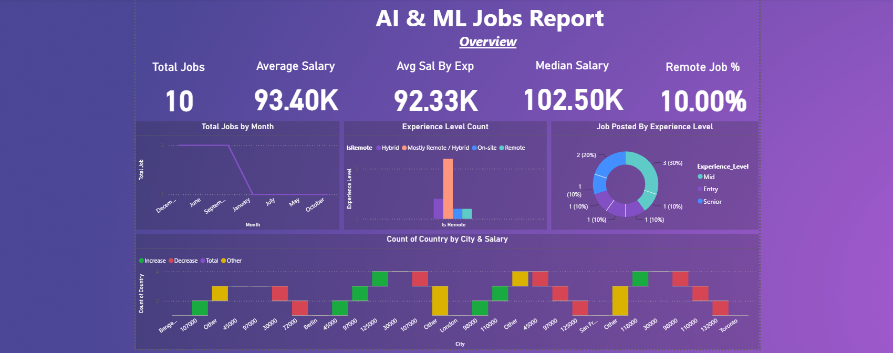
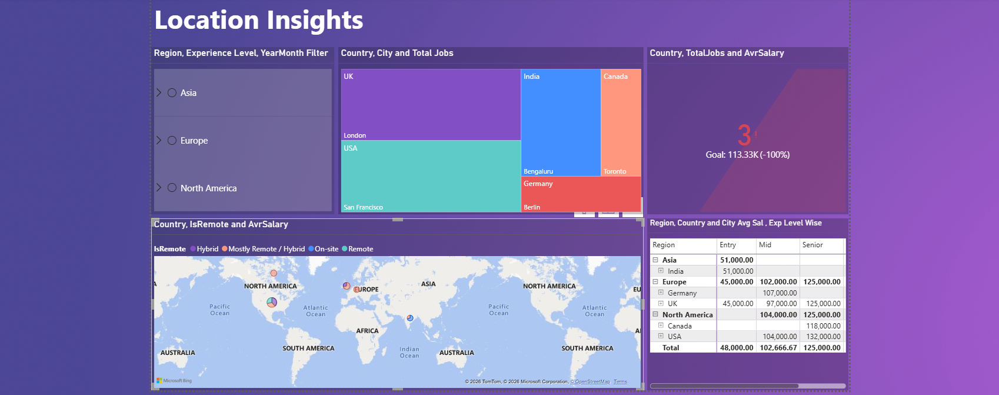
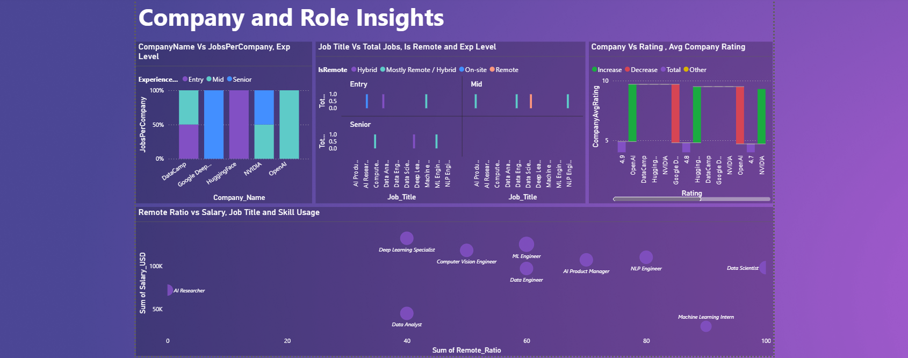
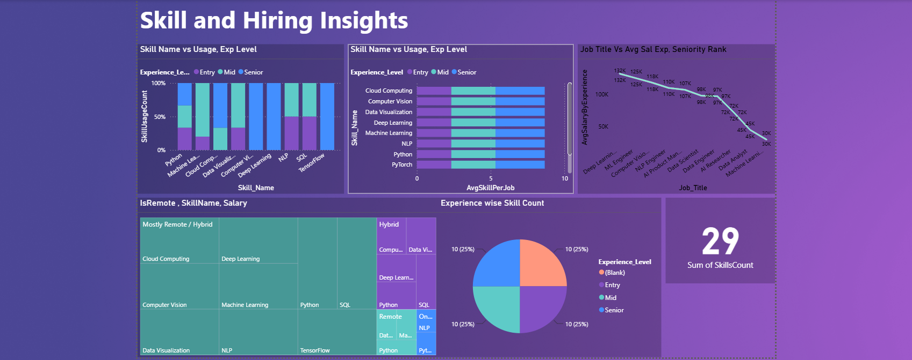

# 🤖 AI & ML Jobs Market Analysis - Power BI Dashboard

## 📝 Project Overview
This repository contains a comprehensive Power BI dashboard analyzing the AI and Machine Learning job market. By aggregating data on job titles, geographical locations, required skills, and salary benchmarks, this project delivers actionable market intelligence for recruiters, data professionals, and job seekers.

> 🍏 **Note for macOS Users:** Microsoft Power BI Desktop is currently only available for Windows operating systems. If you are using a Mac, you cannot open the `.pbix` file directly. Please review the high-resolution dashboard screenshots below to explore the data models, layouts, and insights generated in this project.

## 🖼️ Dashboard Preview

### 1. Market Overview
*Tracks high-level KPIs including average salary ($93.40K), median salary, remote work percentages, and job distribution across experience levels.*

### 2. Location Insights
*Analyzes compensation and job availability across global regions (Asia, Europe, North America) featuring an interactive map and regional salary matrices.*

### 3. Company and Role Insights
*Evaluates top hiring companies (e.g., Google DeepMind, OpenAI, HuggingFace), company ratings, and visualizes the correlation between remote work ratios and salaries by job title.*

### 4. Skill and Hiring Insights
*Breaks down the most in-demand skills (Python, Deep Learning, NLP, SQL) by experience level and plots the salary curve based on job title seniority.*

## 🛠️ Data Architecture & Tech Stack
* **Tool:** Power BI Desktop
* **Data Processing:** Power Query for ETL (Extract, Transform, Load) and data cleansing.
* **Data Modeling:** Designed a Star Schema linking Fact tables (Job Postings, Skills) with Dimension tables (Locations, Companies, Dates).
* **Calculations:** Utilized DAX (Data Analysis Expressions) for custom metrics like average salary aggregates, remote work ratios, and skill counts.

## 🚀 How to Interact with This Project
1. Clone or download this repository to your local machine.
2. Ensure you have **Power BI Desktop** installed (Windows OS required).
3. Open the `.pbix` file to interact with the slicers, cross-filter the visuals, and explore the underlying data model.
